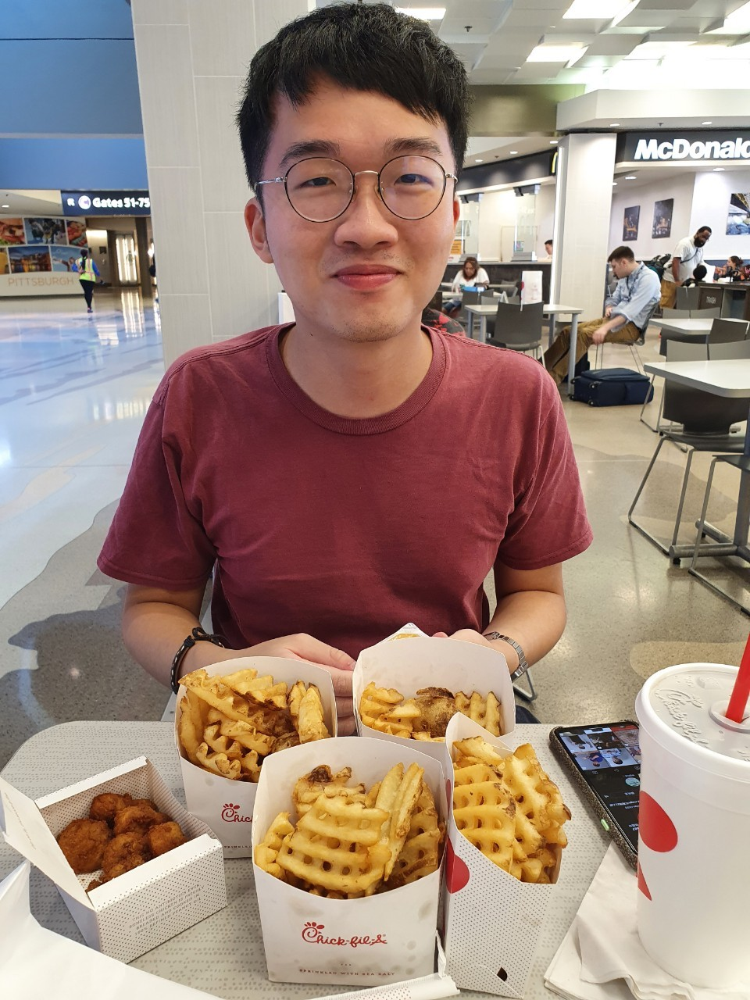
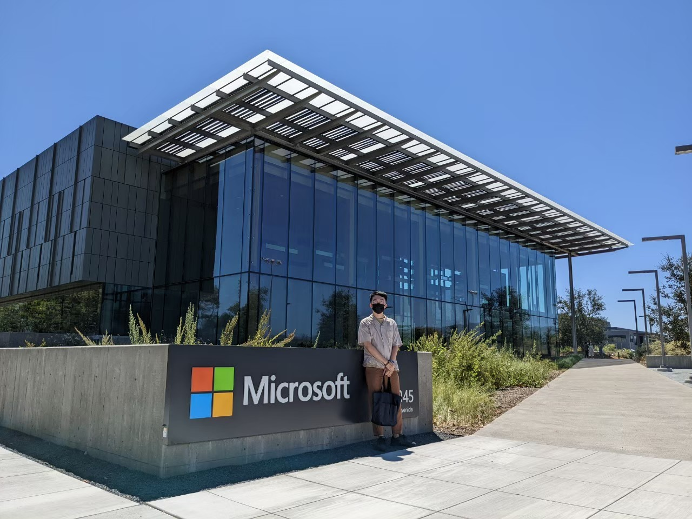

Yung-Chen (Ray) Chang got his B.S. degree in Engineering Sciencce and Ocean Engineering (ESOE) at National Taiwan University. Then he finished his M.S. degree in Computer Science and Information Engineering (CSIE) at National Taiwan University. He was a former RD intern for test automation and lab system in Microsoft Cloud Hardware Infrastructure Engineering (CHIE), and a former NLP intern for chatbot algorithm in Thinkpower Information. 